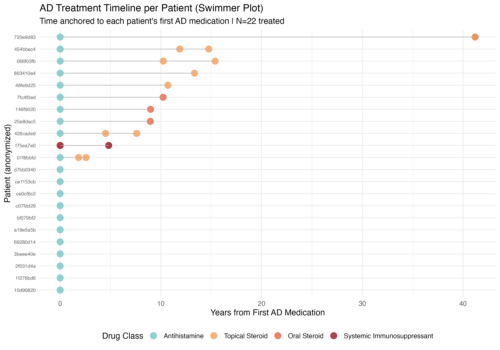

# Atopic Dermatitis Treatment Patterns — Synthetic EHR Cohort

A descriptive real-world evidence (RWE) study built on synthetic EHR data from
[Synthea](https://synthea.mitre.org/). The project traces treatment patterns
across 25 AD patients — from first antihistamine prescription through topical
steroids and, in a small number of cases, systemic immunosuppression.

This is not a statistical inference study. The goal is to demonstrate the full
RWE pipeline: database design, data quality validation, cohort definition, drug
classification, and clinical visualization.

---

## What's in This Repo

| Folder | Contents |
|--------|----------|
| `sql/` | Schema creation, QC checks, constraint/index setup, data fixes, cohort and classification views |
| `data/` | Analytical CSVs exported from PostgreSQL for R |
| `figures/` | Rendered plot outputs |
| `report/` | Quarto report (`.qmd`) — the main deliverable |
| `docs/` | Rendered HTML report — served via GitHub Pages *(auto-generated, do not edit)* |

---

## Key Findings

- 22 of 25 patients had documented AD pharmacotherapy
- Most patients (21/25) were managed with antihistamines alone
- 11 patients showed treatment escalation across drug classes
- One patient cycled between hydrocortisone and cyclosporine over ~5 years,
  consistent with real-world refractory AD management
- Hydrocortisone and cyclosporine prescriptions were confirmed to AD-coded
  encounters; antihistamines were attributed to the broader atopic disease
  spectrum (AD + rhinitis co-occurrence)

---

## Report

The full analysis — including data quality notes, analytical assumptions,
investigation findings, and visualizations — is available as a rendered report:
https://s-yadav21.github.io/ehr_analytics/

---

## Data Quality Notes

Two tables required cleaning before analysis:

- **Observations** — 249 fully duplicate rows removed
- **Medications** — 24 duplicate rows (differing only in cost columns) removed;
  date anomalies corrected

Original tables preserved as `medications_original` and `observations_original`
in the core schema. Full cleaning logic is in `sql/04_data_fixes.sql`.

---

## Stack

- **Database:** PostgreSQL (DBeaver)
- **Analysis & Visualization:** R (tidyverse, ggalluvial, gtsummary, lubridate)
- **Report:** Quarto (HTML, self-contained)
- **Data:** Synthea

---

## How to Reproduce

1. Download 1,000 patients from Synthea Downloads Page.
2. Load CSVs into PostgreSQL using `sql/01_create_schema.sql` and related scripts
3. Run `quarto render report/ad_cohort_analysis.qmd`
